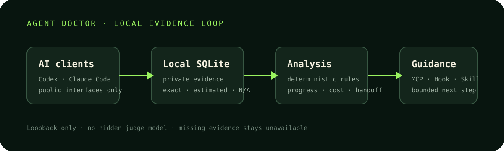

# Agent Doctor by NexoToken

[English](README.md) · [安装说明](docs/install.md) · [NexoToken 配置教程](https://docs.nexotoken.net/) · [兼容矩阵](docs/compatibility.md) · [提交反馈](https://github.com/18534516725/Agent-Doctor/issues/new/choose)

[](https://github.com/18534516725/Agent-Doctor/actions/workflows/ci.yml)
[](LICENSE)
[](docs/launch/public-beta.md)



**给 AI 编程任务增加一层本地、可核对的运行证据。**

Agent Doctor 是 [NexoToken](https://www.nexotoken.net/official/tools/agent-doctor) 发起的开源本地工具。Codex、Claude Code 等客户端继续负责写代码；Agent Doctor 负责整理任务进度、重复循环、验证状态、Token、费用精度和跨客户端交接，并在支持的检查点给 Agent 一条有证据、有边界的下一步建议。

它不是第二个分析模型。诊断规则确定性地运行在本机，不需要额外 API Key。缺失数据保持“不可用”，不会被包装成零。

## 60 秒从源码启动

```bash
git clone https://github.com/18534516725/Agent-Doctor.git
cd Agent-Doctor
./scripts/install-local.sh
```

普通启动：

```bash
agent-doctor start
```

开启一段新的实时捕获会话：

```bash
agent-doctor run -- codex
# 或 agent-doctor run -- claude
```

已经运行的任意进程不会被强行附着，也不会被自动终止。要捕获实时调用，需要通过 wrapper 启动新的客户端进程。

## 你能看到什么

- 任务是否推进、是否长时间没有新证据、是否缺少最终验证；
- 请求、Token、延迟、工具调用和失败率；
- `exact` 精确费用、`estimated` 估算费用和 `unavailable` 缺失证据；
- 当前真正活动的客户端，而不是电脑上所有被发现的应用；
- 本机完整对话明细，以及以分析结果为主的项目驾驶舱；
- 有长度限制、经过过滤的跨客户端任务交接；
- Codex MCP/Skill 和 Claude Code Hook 的真实能力边界。

## 支持范围

仓库为 Codex、Claude Code、Cline、OpenCode、Cursor、Windsurf、Roo Code、Continue、Aider、Cherry Studio 和通用 CLI 声明了能力合同。“支持”不代表每个客户端都暴露同样丰富的信号，具体以[兼容矩阵](docs/compatibility.md)为准。

## 本地隐私

SQLite 在首次运行时自动创建于当前用户配置目录，不会提交到 GitHub。服务只监听 `127.0.0.1`。完整消息只用于本机私有时间线；API Key、Authorization、Cookie 和传输请求头不会写入数据库。

```bash
agent-doctor pause --json          # 暂停采集
agent-doctor pause --resume --json # 恢复采集
agent-doctor export --json         # 导出安全聚合
agent-doctor forget --yes --json   # 删除本地数据库
```

详细边界见[隐私说明](docs/privacy.md)。

## 当前测试版边界

- MCP 和 Skill 能提供建议，但不能保证客户端服从；
- Claude Code 只在官方支持的部分 Hook 点具备控制能力；
- 不读取编辑器私有数据库，不绕过客户端权限；
- 小样本对比只做描述，不会自动宣布某个模型或客户端“最好”；
- 各操作系统和客户端版本仍需要更多真实环境反馈。

## 参与测试

请通过[分类 Issue 表单](https://github.com/18534516725/Agent-Doctor/issues/new/choose)反馈问题，并附操作系统、架构、Agent Doctor 版本、客户端版本、最小复现步骤、预期结果和实际结果。

不要上传完整 SQLite、完整对话、API Key、Authorization 头、私有源码或包含真实路径的完整日志。详见[安全反馈指南](docs/launch/feedback-guide.md)。

## 文档

- [NexoToken AI API 与工具配置教程](https://docs.nexotoken.net/)
- [Codex 配置教程](https://docs.nexotoken.net/coding-tools/codex-cli/)
- [Claude Code 配置教程](https://docs.nexotoken.net/coding-tools/claude-code/)
- [安装、升级与卸载](docs/install.md)
- [隐私模型](docs/privacy.md)
- [费用方法](docs/cost-methodology.md)
- [诊断方法](docs/diagnosis-methodology.md)
- [兼容矩阵](docs/compatibility.md)
- [路线图](docs/roadmap.md)
- [公开测试版说明](docs/launch/public-beta.md)

Apache License 2.0，详见 [LICENSE](LICENSE)。
